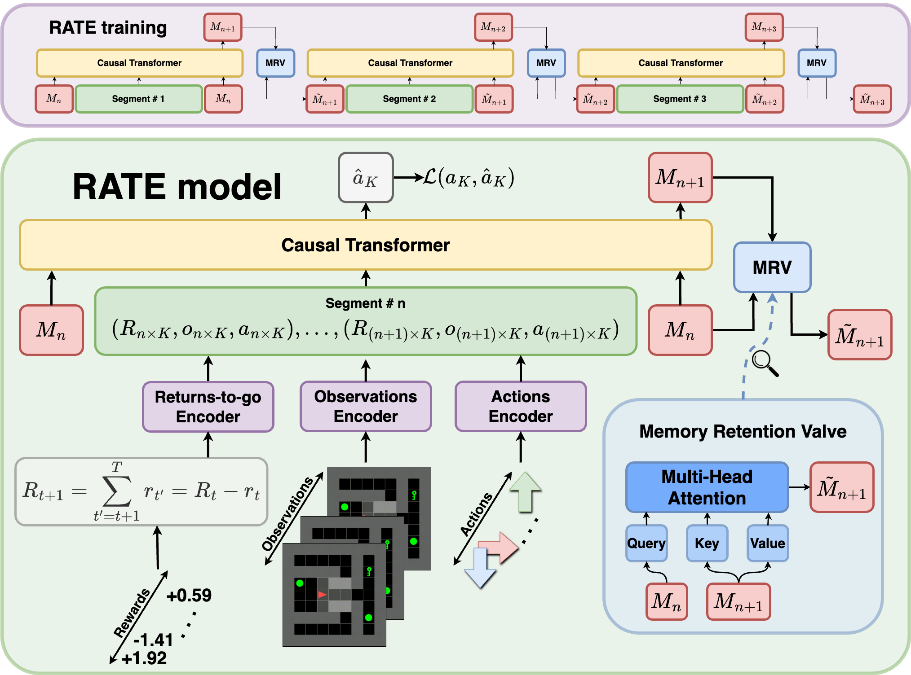
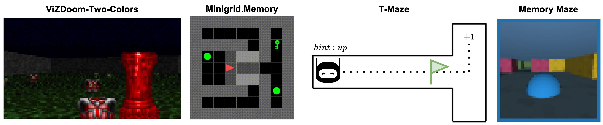
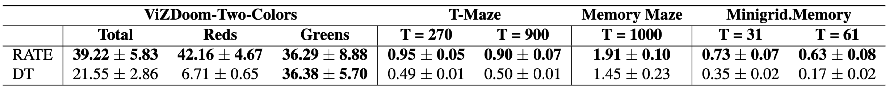
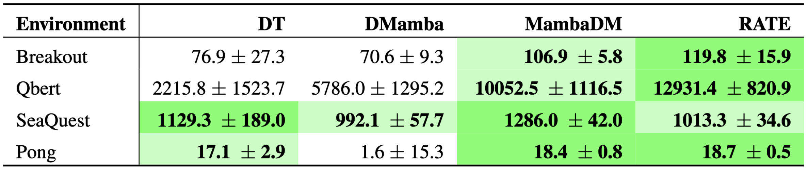
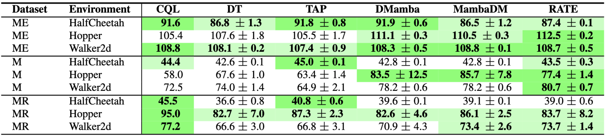

# Recurrent Action Transformer with Memory (RATE) 

Egor Cherepanov\*, Alexey Staroverov\*, Dmitry Yudin, Alexey K. Kovalev and Aleksandr I. Panov

\*equal contribution

The text of the paper can be found at the following link: [arXiv](https://arxiv.org/abs/2306.09459).

## Overview



### Abstract

Recently, the use of transformers in offline reinforcement learning has become a rapidly developing area. This is due to their ability to treat the agent's trajectory in the environment as a sequence, thereby reducing the policy learning problem to sequence modeling. In environments where the agent's decisions depend on past events, it is essential to capture both the event itself and the decision point in the context of the model. However, the quadratic complexity of the attention mechanism limits the potential for context expansion. One solution to this problem is to enhance transformers with memory mechanisms. In this paper, we propose the Recurrent Action Transformer with Memory (RATE) - a model that incorporates recurrent memory. To evaluate our model, we conducted extensive experiments on both memory-intensive environments (VizDoom-Two-Color, T-Maze) and classic Atari games and MuJoCo control environments. The results show that the use of memory can significantly improve performance in memory-intensive environments while maintaining or improving results in classic environments. We hope that our findings will stimulate research on memory mechanisms for transformers applicable to offline reinforcement learning.

## Results

To verify the performance of the model, the following memory-intensive environments (ViZDoom-Two-Colors, Minigrid.Memory, Passive-T-Maze-Flag, Memory Maze) are used in this work:



Results comparing RATE to DT on these memory-intensive benchmarks:



Results comparing RATE to DT on classic Atari and MuJoCo benchmarks:





## Instructions

For each environment we provide code in the following directories: `ViZDoom`, `TMaze_new`, `MinigridMemory`, `MemoryMaze`. See corresponding `README.md` files in each directory for detailed instructions. Scripts should be run from the main directory. 

Before you start experimenting, create a `wandb_config.yaml` file for secrets in the main directory:

```python
# wandb_config.yaml
wandb_api: wandb_api_key
```


## Citation

We would deeply appreciate it if our paper could be cited:

```
@article{cherepanov2024recurrentactiontransformermemory,
      title={Recurrent Action Transformer with Memory}, 
      author={Egor Cherepanov and Alexey Staroverov and Dmitry Yudin and Alexey K. Kovalev and Aleksandr I. Panov},
      year={2024},
      eprint={2306.09459},
      archivePrefix={arXiv},
      primaryClass={cs.LG},
      url={https://arxiv.org/abs/2306.09459}, 
}
```

## License

MIT License

Copyright (c) 2024 AIRI - Artificial Intelligence Research Institute


⠀⠀⠀⠀⠀⠀⠀⠀⠀⠠⠀⠀⠀⠀⠀⠀⠀⠀⠀⠀⠀⠀⠀⠀⠀⠀⠀⠀⠀⠀⢀⠀⢀⣄⠀⠀⠀⠀⠀⠀⠀⠀⠀
⠀⠀⠀⠀⠀⠀⠀⠀⠐⠀⣴⣤⡀⠀⢀⣀⣤⠤⠤⠶⠖⠒⠒⠒⠒⠒⠲⠶⠤⢤⣀⡀⣼⣛⣧⠀⢁⠀⠀⠀⠀⠀⠀
⠀⠀⠀⠀⠀⠀⠀⠀⠀⢀⣸⣏⢻⣍⠁⠀⢀⡀⠤⠄⠒⠒⠒⠒⠒⠒⠀⠤⠄⠀⠀⢸⡳⢾⢹⡀⠀⠀⠀⠀⠀⠀⠀
⠀⠀⠀⠀⠀⠀⠀⣠⠖⠋⠀⢯⡞⣎⡆⠁⠀⠀⠀⢀⡀⠀⠤⠤⠤⠤⠄⠀⡀⠀⠀⠻⣽⣻⡌⠹⣄⠀⠐⠀⠀⠀⠀
⠀⠀⠀⠀⠀⢀⡾⠁⠀⠀⢀⢾⣹⢿⣸⠀⣰⠎⠉⠀⠀⠀⠀⠀⠀⠀⠀⠀⠀⠀⠁⠆⠹⡿⣏⢆⠈⢷⡀⠀⠆⠀⠀
⠀⠀⠀⠀⣰⠏⠀⠀⢀⠔⠛⠄⠙⠫⠇⢀⠁⠀⠀⠀⠀⠀⠀⠀⠀⠀⠀⠀⠀⠀⠀⠈⢄⠠⠒⠒⠵⡈⢳⡀⠀⠀⠀
⠀⠄⠀⡰⠁⠀⠀⢠⠊⠄⠂⠁⠈⠁⠒⠊⠀⠀⠀⠀⠀⠀⠀⠀⠀⠀⠐⡀⠀⠀⠀⠀⠈⠀⠀⠀⠀⠀⠄⢳⡀⠈⠀
⠈⠀⣸⠃⠀⠀⠀⠈⠀⠀⠀⠀⠀⠀⠀⠀⠀⠀⠀⠀⠀⠀⠀⠀⠀⠀⠀⠐⠀⠀⠐⠀⠀⠐⠀⢀⠀⠀⠀⠀⢷⠀⠀
⠀⢠⠇⠂⠀⠀⠀⠀⠀⠀⠀⠀⠀⠀⠀⠘⠀⠀⠀⠀⠀⠰⠀⠀⠀⠀⠀⠀⡄⠀⡀⠆⢰⠀⠀⠀⡄⠀⠀⠀⠸⡄⠀
⠀⣼⠀⠀⠀⠀⠀⠀⠀⠀⠀⠀⠀⡀⠉⠀⡄⠀⢀⠀⠀⡄⠂⠆⠀⠀⠀⠀⢁⠀⢁⠀⢸⠀⢇⠀⡇⠀⠀⠀⠀⣧⠀
⠀⡟⠀⠀⠀⠀⠀⠀⠀⠀⠀⠀⠀⡇⠀⠰⡃⠄⠈⡄⠀⡇⢀⢰⠀⠀⠀⠀⡼⠀⠸⢰⠀⣤⣅⣁⣴⠀⠀⠀⠀⢻⠀
⢠⡇⠀⠀⠀⠀⠀⠀⠀⠠⠀⠀⠀⠱⢀⣁⣤⣧⣴⣧⣄⡇⢸⣸⡄⠀⢀⣆⠀⣦⠊⢹⣿⣿⡛⠻⢿⠀⠀⠀⠀⢸⡇
⢸⡇⠀⠀⠀⠀⠀⠀⠀⠀⣃⠀⠀⢴⣿⠟⠉⢈⣿⣿⣿⡟⠇⠀⠀⠀⠀⠀⠀⢸⣶⣿⣿⡿⣧⠀⢸⡇⠀⢃⠀⢸⡇
⠈⡇⠀⠀⠀⠀⠀⠀⠀⡀⢉⡄⠀⢸⠁⠀⣷⣾⣿⣿⡟⣿⠀⠀⠀⠀⠀⠀⠀⠀⢧⠙⠋⢁⡟⢀⡦⢧⠀⠸⡇⢸⡇
⠀⣿⠀⠀⠀⠀⠀⠀⢀⠔⠪⡄⠀⠸⣁⠀⠹⣉⠉⠉⢠⠏⠀⠀⠀⠀⠀⠀⠀⠀⠈⠓⢲⠛⠆⢉⠀⢸⠀⢀⢇⢸⡇
⠀⢿⠀⠀⠀⠀⠀⢀⠃⡐⠐⣴⠀⠀⠏⠉⠖⠉⠋⡙⠁⠀⠀⠀⠀⠀⠀⢀⠀⠀⠀⢀⡠⠀⠊⠄⠌⢘⠀⠀⠸⢸⠀
⠀⢸⠀⠀⠀⠀⠀⠈⣆⢃⠘⠘⡀⠀⡸⡘⡐⡐⠠⠁⠀⡴⡖⣲⠒⠊⠉⠉⠉⠙⢿⣤⡇⠀⠀⠀⠈⢐⠀⠀⠁⣿⠀
⠀⠘⡇⠀⠀⠀⠀⠀⠈⢶⠬⣁⡇⠀⠀⠑⠐⠤⠐⠀⠀⡇⠉⠀⠀⠀⠀⠀⠀⠀⠀⢙⠇⠀⠀⠀⠀⣼⢀⠀⠀⣿⠀
⠀⠀⣇⠀⠀⠀⢰⠀⠀⠈⠀⠂⡇⠀⠃⢡⠀⠀⠀⠀⠀⠹⡄⠀⠀⠀⠀⠀⠀⠀⣠⠎⠀⠀⢀⡴⡞⡉⠈⠀⠀⣿⠀
⠀⠀⣹⠀⠀⠀⠀⠀⠀⠀⠀⡀⡇⠀⢰⠈⡷⡀⠀⠀⠀⠀⠸⢶⣀⠀⠀⢀⣰⠎⠁⢀⡶⠏⠁⣈⠆⠁⡀⠰⢸⡇⠀
⠀⠀⢸⡀⢸⠀⠀⠆⠀⠀⠀⠀⡇⠀⠀⠀⢡⡄⡏⢆⠒⠢⠤⠤⠤⢨⠥⡴⠒⠚⠉⠉⠀⠀⡠⠁⡘⢠⠁⢀⠆⡇⠀
⠀⠀⢸⡇⠀⡀⠀⠀⠀⠀⢠⢠⠁⠀⠘⡀⠠⣷⠃⠀⠀⠀⠀⠉⢰⠈⢱⠄⡀⡄⠀⢸⠀⠐⠀⠰⠁⠀⠀⡞⠄⣷⠀
⠀⠀⠀⣷⠀⡇⠀⠀⠀⠸⠀⡈⠀⠀⢂⠃⠀⡄⠇⠀⠀⠀⠀⠀⢔⠳⠀⠀⠣⠍⠒⠤⣰⠁⢠⠃⢠⠀⠀⠅⠀⢻⡀
⠀⠀⠀⠉⠀⠁⠀⠀⠀⠀⠀⠁⠀⠀⠈⠀⠀⠁⠈⠀⠀⠀⠀⠀⠀⠉⠁⠀⠀⠈⠁⠀⠈⠀⠁⠀⠈⠀⠀⠁⠀⠈⠁
